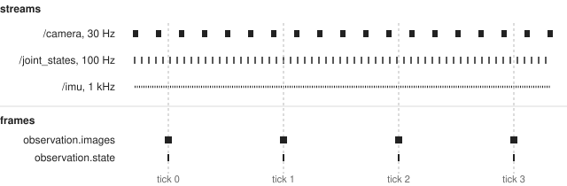
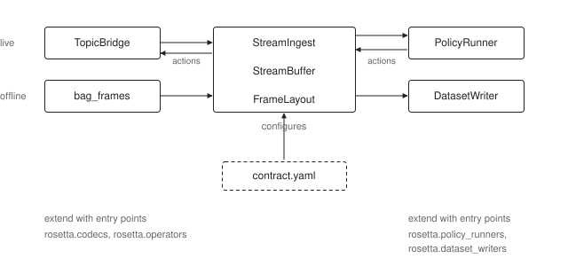

# About the contract

Why there's a YAML file between the robot and the policy, and what it does
for you.

## Streams and frames

A ROS 2 robot publishes topics. Each has its own message type, its own rate,
and its own clock. A policy doesn't consume topics. It consumes frames: at
every tick, one array per key, always the same keys, always the same shapes.

Turning topics into frames means deciding, for every key, which sample
belongs to a tick and on which clock, which fields of the message to keep
and in what order, and how the numbers change on the way in and back out. In
the contract those are `align`, `select` and `apply`.

## Before or after recording

LeRobot's `Robot` class makes those decisions in code. `get_observation()`
hands back a frame, so what you record is already a dataset. Compact, and
one place to look. But anything the class didn't emit is gone. Want a
different image size, one more joint, a different alignment rule? Record
again.

Rosetta makes the decisions after recording. You record bags, every message
at its own rate and stamp, on every topic. The contract runs when you build a
dataset and again when you run the policy. If you change it, you build and
train again. The bags don't move.

This costs disk, since bags are bigger than datasets, and it means the
transform runs at two different times.

## The same code, twice

Two copies of one transform drift apart. Say data preparation
resizes with one library and inference uses another. Nothing crashes. The
policy is a little worse than it should be, and no error points at why.

So both paths run the same three classes. `StreamIngest` reads a message on
its timeline, selects the fields and applies the operators. `StreamBuffer`
picks the sample for each tick. `FrameLayout` lays the values out under
their keys. Offline, `bag_frames` feeds them from a bag. Live, `TopicBridge`
feeds them from subscriptions.

A test in the repo feeds the same messages through `StreamBuffer` and
`FrameLayout` by hand and checks the porter's output against them frame for
frame. One caveat: a stream aligned on
`receive` uses the bag's receive stamp offline and the node clock live, so it
replays closely, not exactly. A stream aligned on `header` replays bit for
bit.

Actions go the other way, live only. `FrameLayout` splits the action vector,
the operators run in reverse, and an encoder builds the message.

## Where the contract stops

At the dataset. Frames come out in robot units, named and shaped the way the
dataset stores them. Normalization, batching and tokenization are the
framework's job and travel with the checkpoint. LeRobot saves its processors
next to the weights. So the contract keeps the robot side the same between
building and serving, and the checkpoint keeps the model side the same.

The contract also travels with the data. The recorder writes it into each
bag's metadata, and the porter writes the contract it was given into the
dataset. A policy runner started without a contract path follows the
checkpoint back to its training dataset and reads the contract there.

## Frameworks

The robot side turns ROS 2 into frames. The policy side turns frames into a
dataset or into actions. Neither imports the other. `rosetta_port` joins
them offline and `policy_runner_node` joins them live, each looking the
framework up by name.

Entry points extend this. `rosetta.codecs` adds message types,
`rosetta.operators` adds value transforms, `rosetta.dataset_writers` and
`rosetta.policy_runners` add a framework. A contract names message types and
operators but never a framework.

## One numeric key on the live path

The porter writes one dataset feature per contract key. LeRobot's live path
does not: its feature builder produces one `observation.state` for all numeric
observations and one `action` for all actions. A contract with two numeric
observation keys ports and trains fine, then fails when the robot connects.

Rosetta checks this where LeRobot is involved, in the Robot plugin's
`connect()` and in the policy runner's configure step. The contract loader
doesn't check it, since the contract isn't tied to LeRobot. If you hit the
limit, merge the streams into one multi-source key.

## Unstamped messages

A message aligned on `header` with a stamp of `(0, 0)` is dropped. Rosetta
doesn't fill in the arrival time. If it did, a driver that forgets to stamp
would look fine in a dataset and behave differently live. The drop is logged
once, and so is recovery. A message honestly stamped at the epoch is lost
too.
